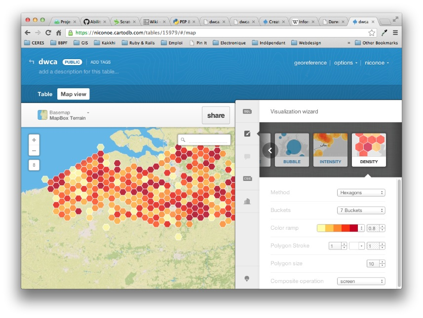

dwca2cartodb
============

What is it ?
------------

A simple command-line tool that allows to directly import a `Darwin Core Archive`_ (DwC-A) file into `CartoDB`_ to allow quick & easy exploration, online collaboration and use of biodiversity data.

In practice
-----------

First, you'll need to create a free account at `CartoDB`_.

1. Find a DwC-A file, starting for example from `this list of IPT instances <http://gbrds.gbif.org/browse/start?agentType=14100&filterValue=IPT&pageNo=1&pageSize=100>`_ .

2. Run this script (see USE section below)

3. Visualize and share your data online:

Status
------

IN DEVELOPMENT. Very basic use works, but its currently missing important pieces:

* Ability to (smartly) guess location from multiple fields. For now, it is simply read from the decimalLatitude and decimalLongitude fields.
* Ability to configure imported (other than location) fields.
* Implement automated tests to make the script more robust.
* ...

Install & Requirements
----------------------

For now, clone this repository and install the following dependencies via easy_install / pip. Once the project is a little more advanced, a proper Python package will be availabe on PyPI.

* cartodb==0.6
* python-dwca-reader==0.1.1
* pyshp==1.1.4
* pyproj==1.9.3

Use
---

::
    
    $ python dwca2cartodb.py --domain <YOUR_CARTODB_DOMAIN> --api-key <YOUR_API_KEY> --table <YOUR_TABLE_NAME> your-dwca.zip

You can add "--truncate" to truncate existing CartoDB table before importing new data (useful for multiple imports in a row).

.. _Darwin Core Archive: http://en.wikipedia.org/wiki/Darwin_Core_Archive
.. _CartoDB: http://cartodb.com/